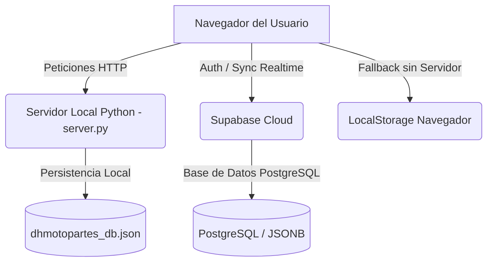

# Documentación Oficial - DHMotopartes

**DHMotopartes** es un sistema moderno de Punto de Venta (POS) y Administración de Inventario desarrollado con diseño premium y soporte multi-inquilino (*Multi-Tenant SaaS*), enfocado específicamente en tiendas de repuestos para motocicletas y venta de herramientas.

El sistema está diseñado para operar en dos modalidades según las necesidades del comercio:
1. **Modo Local (Offline):** Servidor local ligero escrito en Python (`server.py`) que almacena la información en un archivo JSON local y permite conectar dispositivos en la misma red Wi-Fi.
2. **Modo Cloud SaaS (Supabase):** Base de datos distribuida en la nube con autenticación segura, control de acceso por roles (RBAC) a nivel de servidor (RLS) y sincronización de datos en tiempo real mediante WebSockets.

---

## 📂 Estructura de Archivos del Proyecto

El espacio de trabajo consta de los siguientes componentes clave:

| Archivo / Carpeta | Tipo | Descripción |
| :--- | :--- | :--- |
| [index.html](file:///c:/Users/Julian%20Karata/Downloads/dhmotopartes/index.html) | Frontend HTML | Estructura principal de la interfaz Single Page Application (SPA). Contiene todas las vistas y modales del sistema. |
| [app.js](file:///c:/Users/Julian%20Karata/Downloads/dhmotopartes/app.js) | Frontend JS | Núcleo del sistema: lógica de negocio, enrutador interno, gestor de estado global y sincronización con Supabase. |
| [components.js](file:///c:/Users/Julian%20Karata/Downloads/dhmotopartes/components.js) | Frontend JS | Componentes interactivos como el gráfico SVG de ventas y plantillas HTML dinámicas (p. ej., tickets de compra). |
| [style.css](file:///c:/Users/Julian%20Karata/Downloads/dhmotopartes/style.css) | Estilos CSS | Diseño visual premium con soporte para modo oscuro/claro y variables dinámicas. |
| [server.py](file:///c:/Users/Julian%20Karata/Downloads/dhmotopartes/server.py) | Backend Python | Servidor HTTP local que sirve los archivos estáticos y expone APIs JSON para guardar la base de datos localmente. |
| [supabase-config.js](file:///c:/Users/Julian%20Karata/Downloads/dhmotopartes/supabase-config.js) | Configuración | Inicialización del cliente de Supabase JS SDK. |
| [supabase_saas_migration.sql](file:///c:/Users/Julian%20Karata/Downloads/dhmotopartes/supabase_saas_migration.sql) | Script SQL | Esquema de base de datos de Supabase, funciones PL/pgSQL, políticas RLS y triggers de seguridad. |
| [stress_test.py](file:///c:/Users/Julian%20Karata/Downloads/dhmotopartes/stress_test.py) | Utilidad | Script de prueba para validar la resistencia de Supabase ante guardados concurrentes y el sistema de bloqueo optimista. |
| [dhmotopartes_db.json](file:///c:/Users/Julian%20Karata/Downloads/dhmotopartes/dhmotopartes_db.json) | Base de datos | Almacenamiento local del estado global en formato JSON cuando se utiliza el modo local. |

---

## 🏛️ Arquitectura del Sistema

### 1. Gestión de Estado Global (State)
Toda la información del sistema (repuestos, clientes, ventas, movimientos de caja, configuraciones) se almacena en un único objeto de estado unificado que se serializa como JSON. Esto permite:
* Guardado atómico instantáneo.
* Estructura simplificada que facilita los respaldos y migraciones.
* Sincronización transparente tanto en LocalStorage, JSON local como en Supabase (`store_states`).

### 2. Base de Datos en Supabase (Multi-Tenant)
Cuando la aplicación está conectada a Supabase, se implementa una arquitectura SaaS aislada:
* **`stores`**: Tabla maestra que contiene las empresas individuales registradas.
* **`user_profiles`**: Perfiles de usuarios vinculados a una tienda mediante `store_id` y con un rol específico (`role`).
* **`store_states`**: Contiene el estado JSON completo de cada tienda en la columna `state`.
* **Row Level Security (RLS)**: Ningún usuario puede leer o modificar datos que pertenezcan a un `store_id` diferente al suyo, garantizando aislamiento estricto entre empresas a nivel de base de datos.

---

## 👤 Jerarquía de Roles y Seguridad (RBAC)

El sistema restringe el acceso a las vistas y las consultas de base de datos según el rol asignado en la columna `role` de la tabla `user_profiles`:

1. **`usuario` (Por defecto):**
   * Cuenta creada recientemente sin verificar. No tiene acceso a ninguna tienda ni datos de base de datos. Se mantiene bloqueado en la pantalla de Login.
2. **`cajero`:**
   * Rol optimizado para ventas en mostrador.
   * **Acceso único al Punto de Venta (POS)** para registrar compras, escanear artículos mediante lector de códigos de barra y procesar transacciones.
   * Tiene bloqueado el Dashboard de ganancias, historial de ventas pasadas, control de inventario, CRM de clientes y configuración del sistema.
3. **`admin` / `superadmin`:**
   * Control total sobre la tienda asignada.
   * Acceso a métricas en tiempo real, alertas de stock mínimo, gestión de inventario completa, importación/exportación de catálogos mediante Excel, control de caja de dinero y anulación de transacciones.
   * *El rol `superadmin` incluye adicionalmente una sección para administrar y dar de alta a los empleados de su tienda.*
4. **`saas_admin` (Administrador Global):**
   * Nivel máximo del software. Permite registrar nuevas empresas (tiendas) en el sistema y supervisar el listado completo de clientes corporativos desde el **Panel SaaS Global**.

---

## 🛠️ Características Funcionales por Módulo

### 📊 Panel de Control (Dashboard)
* Visualización en tiempo real de KPIs: Ventas del día, monto total cobrado, número de artículos en inventario y alertas de stock crítico.
* Gráfico de línea dinámico interactivo en SVG (creado en [components.js](file:///c:/Users/Julian%20Karata/Downloads/dhmotopartes/components.js)) que representa las tendencias de ventas diarias de la última semana.
* Feed en vivo con alertas rápidas de repuestos próximos a agotarse.

### 🛒 Punto de Venta (POS)
* Interfaz táctil ágil con catálogo por categorías.
* Barra de búsqueda rápida predictiva por SKU o nombre de repuesto.
* Integración nativa con lector de código de barras físico.
* Carrito de compras con soporte para aplicar descuentos en porcentaje o monto fijo y selección de clientes registrados.
* Módulo de cobro rápido con calculadora de cambio según billetes recibidos.

### 📦 Control de Inventario
* Tabla interactiva con paginación optimizada para no sobrecargar dispositivos antiguos.
* Estado de stock controlado mediante semáforos de colores (Suficiente, Bajo, Agotado).
* Editor integrado de artículos (SKU, nombre, costo, precio, categoría, stock actual e inventario mínimo de alerta).
* Sistema de importación/exportación directa a hojas de cálculo Excel (`.xlsx`).

### 👥 CRM de Clientes
* Registro de datos personales, contacto y acumulación automática de puntos de fidelidad por cada compra para incentivar ventas recurrentes.

### 💰 Control de Caja
* Auditoría de caja diaria con registro histórico de ingresos y egresos manuales (p. ej., pago a proveedores locales, fletes o retiros parciales).

---

## 🔒 Mecanismos de Concurrencia (Optimistic Locking)

Para evitar la pérdida de datos en entornos donde múltiples cajeros realizan ventas al mismo tiempo, el sistema implementa un algoritmo de **Bloqueo Optimista** basado en versiones en [app.js:L738](file:///c:/Users/Julian%20Karata/Downloads/dhmotopartes/app.js#L738):
1. Cada vez que se modifica la base de datos localmente, se incrementa un campo `version` en el estado JSON.
2. Al guardar en Supabase, se condiciona la consulta: `.eq('state->>version', oldVersion.toString())`.
3. Si otra terminal guardó una venta una fracción de segundo antes, la actualización fallará por colisión de versión.
4. El sistema captura la colisión, descarga los cambios de la otra computadora, **los fusiona automáticamente en segundo plano** (conciliando productos, combinando las ventas nuevas y sumando movimientos de caja) y reintenta el guardado sin interrumpir la operación del cajero.
